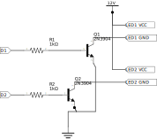

# Cooplight

A NodeMCU project to have an ESP8266 drive a bunch of LEDs around dusk. Our chickens keep
getting in too late and then they don't see their roosts well enough to get up to them.

This uses two pieces of white LED strip (with three LEDs each), on their on transistor, driven by two
GPIO pins. This keeps GPIO current and small transistor power dissipation low.

Apart from gpio, this uses NodeMCU's sntp and rtc modules to keep the time, so this will
only reliably work if there's a WiFi signal.

## Circuit

Circuit is very simple. I had a piece of white LED strip left over and tested how much power it drew
using my bench supply. Turned out I only had small transistors, so I've cut the strip in half, each
now has three LEDs, a resistor, and the soldering pads on it.

The resistors are 1% (who cares), the transistors are whatever I had for NPN. The whole thing is fed from
the coop's solar panel at "car battery level" (nominally 12V but expect 13.8V or so), so I tossed in an LM-2596
to get the 5V for USB. I decided to feed the NodeMCU board through the USB port because that way, nothing unexpected
can happen - it either gets 5V from the power supply or I disconnect it to reprogram it and then it gets 5V from
the computer, no way it can somehow accidentally be wired up to both by using the plug as power supply.
